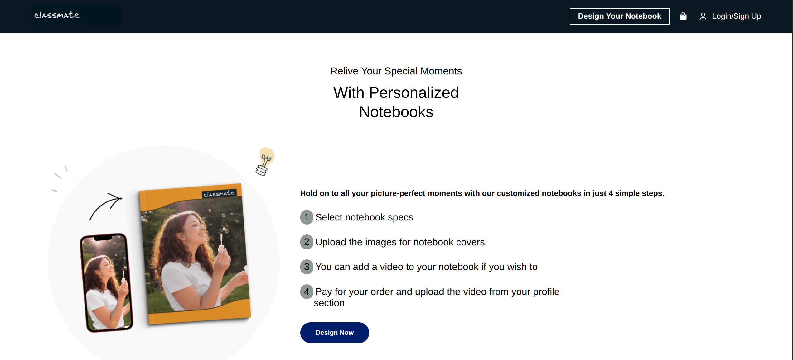

# Classmate Website



<br>

A simple static website showcasing personalized notebooks from Classmate, created using HTML and CSS for learning and showcasing front-end development skills.

## How I Made This
I created this project by designing a layout inspired by notebook customization themes. I used HTML to structure the content, including the header with tagline, 4-step ordering process, product features like customizable covers and AI-generated images, promotional elements, community engagement, social impact mentions, and customer testimonials. CSS was applied for styling, such as colors, fonts, and layout. Images for products, icons, and banners were placed in a dedicated folder and referenced in the HTML.

## Project Structure
- `index.html`: The main HTML file containing the page structure.
- `css/`
  - `styles.css`: CSS stylesheet for styling and layout.
- `images/`: Folder containing image assets used in the page (e.g., product images, logos, banners).

## Live Link
https://afsal4.github.io/CLASSMATE/

## Git Clone Command
```bash
git clone https://github.com/afsal4/CLASSMATE.git
```
